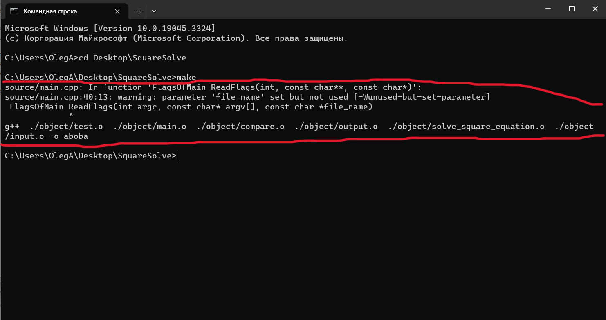
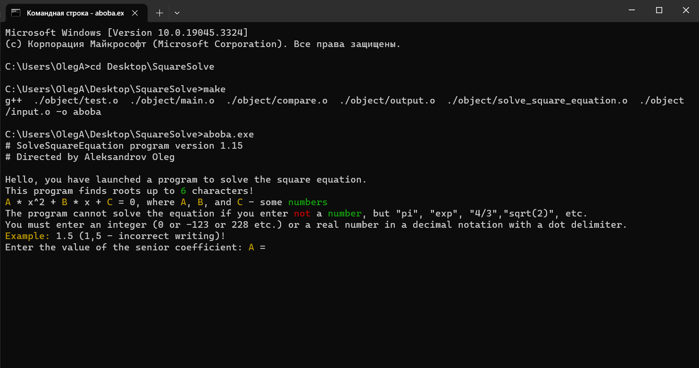

<h1 align="center">Hi there, I'm <a href="https://t.me/Chin_chinless" target="_blank">Oleg</a> 
</h1>
<h4 align="center">I am the author of project:</h4>
<h1 align = "center"> SquareSolve </h1>
<h4 align = "center" >This program can solve the square equation</h4>

<h2>**How install the program on your PC?**</h2>
In this guide, the author shows the program launch in Windows. 
If you want to know, how install program on other OS, write me in <a href="https://t.me/Chin_chinless" target="_blank">telegram</a>

1) Install files from github.
2) Open the project folder in the console (Example: On windows my project is in:)
   
3) Write in terminal "make"! Example: 
   
4) After this command you can see this:
   
5) Then write in termial "aboba.exe". Example:
   
6) Follow the guide in the terminal and **get your answer!**
   

<h2 align = "center"> Thank you for reading! </h2>
<h4 align = "center"> If you have any questions, write on Telegram(link above) </h4>

